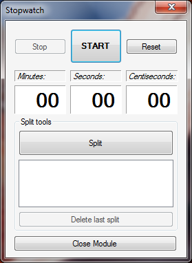
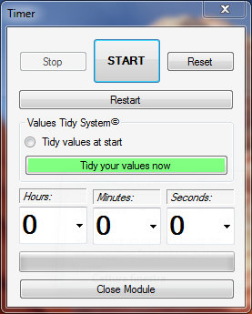
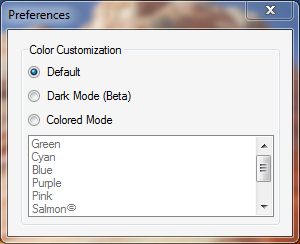

# V.T.T.-v2
A school project developed using Visual Basic. This very simple software uses computer timer tick inside a timer and a stopwatch with also the possibility to customize some graphical aspects.

<h3>How to install:</h3>
You just have to go to <code>V.T.T.-v2/Vignaroli's Time Tools 2/bin/Release</code> and open the installer which will automatically do his job :)

<h3>Project explanation</h3>
This is a school project (as I said before) so it isn't a very big and complex software but it works fine.
<h4>The stopwatch:</h4>
This is a very common stopwatch, with the possibility to split the results that you need. My future goal will be to add a button to export the list of results in an Excel spreadsheet.  

<h4>The timer:</h4>
A very common timer with an uncommon feature, as I call it, <strong>the tidy system</strong>. The software can automatically convert your time values to tidy them, so you can put for example 120 seconds and by checking the radio button or by pressing the tidy button the software will convert it in 2 minutes.  

<h4>The preferences:</h4>
There is also the possibility to change and customize some graphical aspects inside the application. Opening the preferences form you can modify the background color of the entire program.  

<h3>Devoloper zone:</h4>
If you want to see the algorythms that this program uses you should see: 
<code>V.T.T.-v2/Vignaroli's Time Tools 2/FormHome.vb</code> 
<code>V.T.T.-v2/Vignaroli's Time Tools 2/FormStopwatch.vb</code> 
<code>V.T.T.-v2/Vignaroli's Time Tools 2/FormTimer.vb</code> 
<code>V.T.T.-v2/Vignaroli's Time Tools 2/FormPreferences.vb</code>
